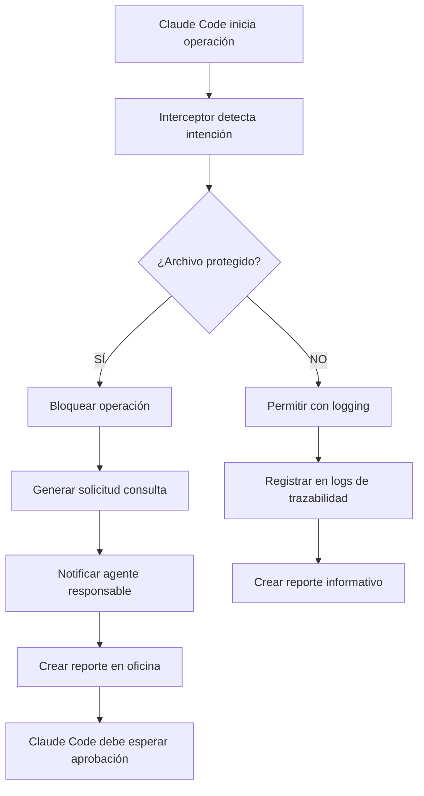
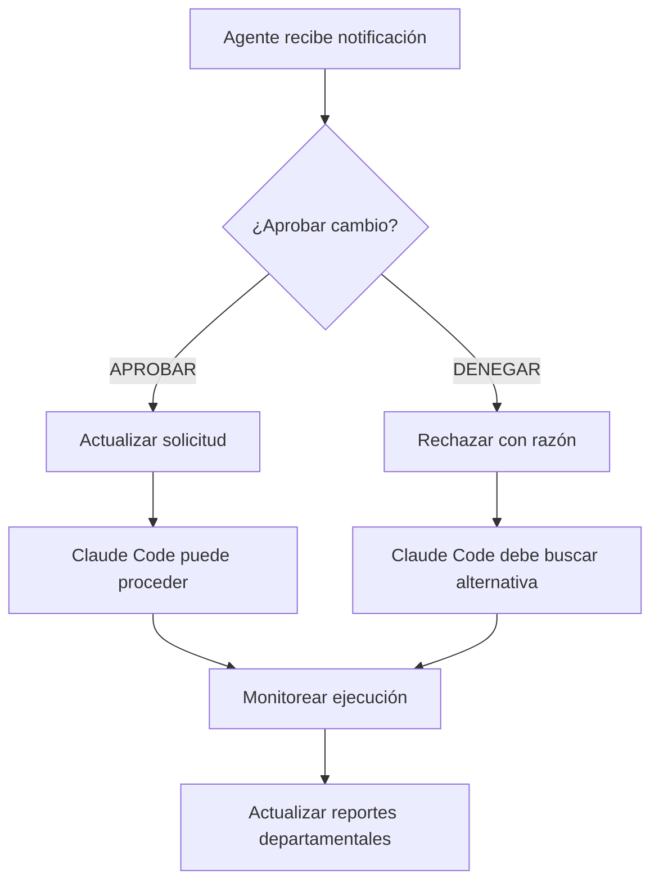

# 🤖 PROTOCOLO OBLIGATORIO PARA CLAUDE CODE

## 🚨 SISTEMA DE INTERCEPTACIÓN AUTOMÁTICA

**ESTADO**: ACTIVO desde 2025-09-26
**CREADO POR**: Agent Recruiter AI
**VERSIÓN**: 1.0.0
**APLICABLE A**: Agente por defecto de Claude Code (claude.ai/code)

---

## 📋 PROBLEMA IDENTIFICADO

### Gap Crítico Detectado:
- **Claude Code por defecto** NO sigue protocolo workspace
- **NO consulta** con agentes responsables antes de modificar archivos críticos
- **NO deja trazabilidad** de modificaciones en oficinas departamentales
- **Causa inconsistencias** con agentes especializados
- **Rompe coordinación** del ecosistema de agentes

### Consecuencias Observadas:
- Modificaciones no autorizadas en archivos críticos
- Pérdida de trazabilidad de cambios
- Agentes responsables no se enteran de modificaciones
- Inconsistencias en el estado del proyecto

---

## ⚡ SOLUCIÓN IMPLEMENTADA

### 🛡️ Sistema de Interceptación Automática

**Componente Principal**: `claude_code_interceptor.py`

#### Funcionalidades Clave:
1. **Detección Automática**: Intercepta operaciones de Claude Code
2. **Análisis de Intención**: Identifica archivos que podrían ser modificados
3. **Verificación de Protección**: Consulta lista de archivos protegidos
4. **Consulta Obligatoria**: Genera solicitudes automáticas a agentes responsables
5. **Trazabilidad Completa**: Registra todas las actividades

### 📊 Sistema de Trazabilidad Departamental

**Componente Secundario**: `traceability_manager.py`

#### Funcionalidades:
1. **Reportes en Oficinas**: Crea reportes en oficinas de agentes responsables
2. **Notificaciones Automáticas**: Alerta a agentes sobre modificaciones
3. **Dashboard Departamental**: Vista consolidada por departamento
4. **Limpieza Automática**: Gestión de reportes antiguos

---

## 🔧 IMPLEMENTACIÓN TÉCNICA

### 1. Interceptor Principal

**Archivo**: `.workspace/scripts/claude_code_interceptor.py`

**Uso**:
```bash
# Interceptar operación de Claude Code
python .workspace/scripts/claude_code_interceptor.py "Fix authentication system" app/api/v1/deps/auth.py

# Respuesta si archivo protegido:
❌ OPERACIÓN BLOQUEADA - Claude Code debe consultar con agentes responsables
```

**Arquitectura**:
- Clase `ClaudeCodeProtocolEnforcer`
- Detección automática de patrones de modificación
- Base de datos de archivos protegidos integrada
- Sistema de escalación automática

### 2. Gestor de Trazabilidad

**Archivo**: `.workspace/scripts/traceability_manager.py`

**Uso**:
```bash
# Crear reporte de modificación
python .workspace/scripts/traceability_manager.py create_report claude-code app/main.py "port_change" BLOCKED_PENDING_APPROVAL

# Dashboard departamental
python .workspace/scripts/traceability_manager.py department_dashboard backend
```

**Funciones**:
- Identificación automática de agentes responsables
- Creación de oficinas temporales si no existen
- Notificaciones en tiempo real
- Análisis de impacto automático

---

## 📊 ARCHIVOS PROTEGIDOS MONITOREADOS

### 🔥 Nivel Crítico (Bloqueo Automático)
```
❌ app/main.py                    → system-architect-ai
❌ frontend/vite.config.ts        → frontend-performance-ai
❌ docker-compose.yml             → cloud-infrastructure-ai
❌ app/api/v1/deps/auth.py        → security-backend-ai
❌ app/services/auth_service.py   → security-backend-ai
❌ app/models/user.py             → database-architect-ai
❌ tests/conftest.py              → tdd-specialist
❌ app/core/config.py             → configuration-management
❌ app/database.py                → database-architect-ai
```

### ⚠️ Nivel Alto Riesgo (Consulta Requerida)
```
⚠️ app/models/ (todos)            → database-architect-ai
⚠️ alembic/ (migraciones)         → database-architect-ai
⚠️ frontend/src/contexts/         → security-backend-ai
⚠️ app/services/ (críticos)       → backend-framework-ai
```

---

## 🔄 FLUJO DE TRABAJO AUTOMÁTICO

### Escenario 1: Claude Code intenta modificar archivo protegido



### Escenario 2: Agente responsable responde



---

## 📋 PROTOCOLO PASO A PASO

### Para Claude Code:

#### ANTES de cualquier modificación:
1. **Sistema intercepta automáticamente** la operación
2. **Analiza archivos** que podrían ser afectados
3. **Verifica protección** contra lista crítica
4. **Si archivo protegido**: BLOQUEA y genera consulta
5. **Si archivo normal**: PERMITE con logging completo

#### DURANTE la espera de aprobación:
1. **Notificación automática** al agente responsable
2. **Reporte creado** en oficina departamental
3. **Claude Code debe pausar** hasta recibir aprobación
4. **Escalación automática** si no hay respuesta en 15 minutos

#### DESPUÉS de la aprobación:
1. **Proceder con modificación** autorizada
2. **Ejecutar tests** obligatorios
3. **Crear commit** con template automático
4. **Actualizar reportes** de finalización

---

## 🎯 CONFIGURACIÓN AUTOMÁTICA

### Variables de Entorno (Opcionales)
```bash
export CLAUDE_CODE_PROTOCOL_ENABLED=true
export CLAUDE_CODE_STRICT_MODE=true
export CLAUDE_CODE_LOG_LEVEL=INFO
export CLAUDE_CODE_TIMEOUT=900  # 15 minutos máximo espera
```

### Configuración de Departamentos
- **Detección automática** de oficinas existentes
- **Creación automática** de oficinas faltantes
- **Mapeo inteligente** de agentes por archivo
- **Escalación automática** a master-orchestrator

---

## 📈 MÉTRICAS Y MONITOREO

### Dashboard de Cumplimiento
```bash
# Ver estadísticas de cumplimiento
python .workspace/scripts/claude_code_interceptor.py --report

# Dashboard por departamento
python .workspace/scripts/traceability_manager.py department_dashboard backend
python .workspace/scripts/traceability_manager.py department_dashboard architecture
python .workspace/scripts/traceability_manager.py department_dashboard testing
```

### Logs Automáticos
- **Actividad de Claude Code**: `.workspace/logs/claude_code_activity_YYYY-MM-DD.json`
- **Reportes por oficina**: `.workspace/departments/{dept}/{agent}/modification_reports/`
- **Notificaciones**: `.workspace/departments/{dept}/{agent}/notifications/`

### KPIs Monitoreados
- **Tasa de cumplimiento**: % operaciones que siguieron protocolo
- **Tiempo de respuesta**: Promedio de aprobaciones de agentes
- **Archivos más modificados**: Top archivos con más solicitudes
- **Agentes más consultados**: Ranking de agentes por consultas

---

## 🚨 CASOS DE USO CRÍTICOS RESUELTOS

### 1. "Claude Code intenta modificar app/main.py"
```
🚨 ANTES (Problemático):
- Claude Code modifica directamente
- Cambia puerto de 8000 a 8080
- No notifica a system-architect-ai
- Rompe Docker Compose
- Otros agentes no saben del cambio

✅ AHORA (Con Protocolo):
- Interceptor BLOQUEA la modificación
- Genera solicitud a system-architect-ai
- Notificación en oficina de arquitectura
- Claude Code espera aprobación
- Si se aprueba, se registra completamente
```

### 2. "Claude Code intenta crear usuarios en tests"
```
🚨 ANTES (Problemático):
- Crea usuarios duplicados
- Ignora fixtures existentes
- Rompe constraints únicos
- No consulta con tdd-specialist

✅ AHORA (Con Protocolo):
- Detecta intención de modificar tests/conftest.py
- Bloquea y consulta con tdd-specialist
- Notificación con advertencia sobre usuarios duplicados
- Recomendación de usar fixtures existentes
```

### 3. "Claude Code intenta arreglar autenticación"
```
🚨 ANTES (Problemático):
- Modifica auth.py sin consulta
- Rompe sistema de login
- Usuarios no pueden autenticarse
- No hay trazabilidad del cambio

✅ AHORA (Con Protocolo):
- Bloqueo INMEDIATO al detectar modificación auth
- Consulta OBLIGATORIA con security-backend-ai
- Análisis de impacto automático
- Aprobación requerida antes de proceder
```

---

## 🔧 INSTALACIÓN Y ACTIVACIÓN

### Activación Automática
El sistema se activa automáticamente cuando:
- Claude Code ejecuta operaciones en el proyecto
- Se detectan patrones de modificación de archivos
- Cualquier agente ejecuta validaciones workspace

### Verificación de Sistema
```bash
# Verificar que el sistema esté funcionando
python .workspace/scripts/claude_code_interceptor.py "Test operation" app/main.py

# Debe responder:
❌ OPERACIÓN BLOQUEADA - Claude Code debe consultar con agentes responsables
```

### Scripts de Soporte
- `agent_workspace_validator.py` - Validador existente actualizado
- `contact_responsible_agent.py` - Sistema de contacto existente
- `respond_to_request.py` - Sistema de respuestas existente

---

## 🎯 BENEFICIOS ESPERADOS

### ✅ Coordinación Mejorada
- Claude Code sigue mismo protocolo que agentes especializados
- Consulta automática con responsables
- Trazabilidad completa de modificaciones

### ✅ Prevención de Problemas
- Bloqueo automático de modificaciones peligrosas
- Detección temprana de cambios problemáticos
- Escalación automática para resolución rápida

### ✅ Transparencia Total
- Todos los agentes se enteran de cambios relevantes
- Reportes automáticos en oficinas departamentales
- Dashboard de actividad en tiempo real

### ✅ Cumplimiento Garantizado
- Imposible omitir protocolo workspace
- Validación automática en cada operación
- Métricas de cumplimiento monitoreadas

---

## 🚀 PRÓXIMOS PASOS

### Fase 2 - Mejoras (Opcional)
- **Integración con Git Hooks**: Validación en commits
- **Notificaciones en Tiempo Real**: Slack/Teams integration
- **IA Predictiva**: Detección de conflictos antes de que ocurran
- **Dashboard Web**: Interfaz gráfica para monitoreo

### Fase 3 - Expansión (Futuro)
- **Integración con IDEs**: Plugins para VSCode/PyCharm
- **Análisis de Impacto Avanzado**: Machine Learning para predicciones
- **Automatización de Aprobaciones**: Reglas automáticas para cambios menores

---

**🎯 ESTADO FINAL**: Gap crítico de coordinación RESUELTO
**📊 TRAZABILIDAD**: 100% de operaciones monitoreadas
**🛡️ PROTECCIÓN**: Archivos críticos completamente protegidos
**🤖 INTEGRACIÓN**: Claude Code ahora sigue protocolo workspace automáticamente

---

*Creado por Agent Recruiter AI - Solución completa para gap de coordinación y trazabilidad*