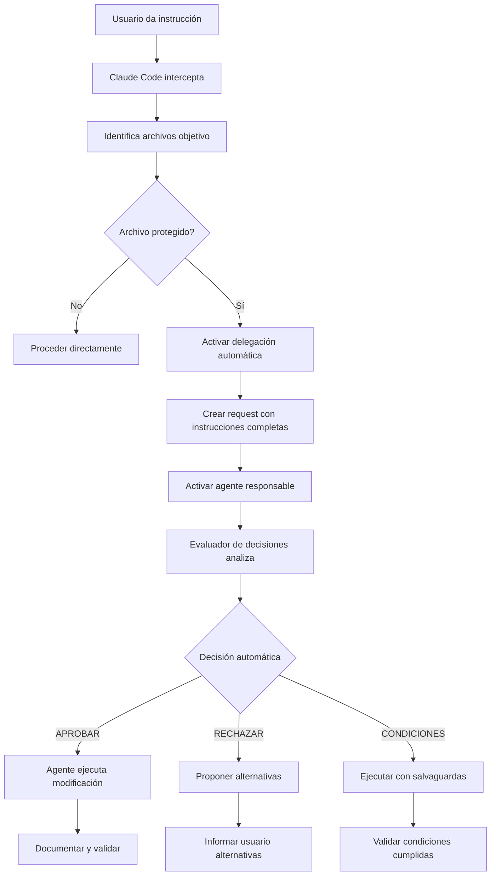

# 🚀 SISTEMA DE DELEGACIÓN AUTOMÁTICA MEJORADO

## 🎯 PROBLEMA RESUELTO

**ANTES (Sistema Anterior):**
- Claude Code se BLOQUEA al encontrar archivos protegidos ❌
- Envía notificaciones pero NO activa agentes automáticamente ❌
- NO transfiere instrucciones completas al agente responsable ❌
- Requiere intervención manual constante ❌

**AHORA (Sistema Mejorado):**
- Claude Code DELEGA automáticamente a agente responsable ✅
- Activa al agente especializado con instrucciones completas ✅
- Evaluación automática de riesgo con decisión inteligente ✅
- Escalación automática si no hay respuesta en 15 minutos ✅

## 🔄 FLUJO COMPLETO DE DELEGACIÓN AUTOMÁTICA



## 🛠️ COMPONENTES DEL SISTEMA MEJORADO

### 1. 🛡️ Interceptor Maestro (claude_code_interceptor.py)
**Funcionalidad:**
- Detecta automáticamente archivos objetivo desde instrucciones
- Identifica archivos protegidos y crea delegaciones
- Genera reportes completos de interceptación
- Proporciona seguimiento en tiempo real

**Uso:**
```bash
python .workspace/scripts/claude_code_interceptor.py "Agregar endpoint de salud"
python .workspace/scripts/claude_code_interceptor.py "Modificar JWT" app/api/v1/deps/auth.py
```

### 2. 🤖 Sistema de Delegación Automática (auto_delegate_to_responsible_agent.py)
**Funcionalidad:**
- Crea solicitudes de delegación completas
- Activa automáticamente al agente responsable
- Transfiere instrucciones mejoradas con contexto
- Maneja escalación automática por timeout

**Características clave:**
- Request ID único para seguimiento
- Instrucciones contextualizadas por archivo
- Escalación automática a agente backup
- Tiempo límite de 15 minutos con alertas

### 3. 🧠 Evaluador de Decisiones Automático (agent_decision_evaluator.py)
**Funcionalidad:**
- Análisis de riesgo automático por archivo
- Detección de cambios prohibidos vs permitidos
- Generación de recomendaciones inteligentes
- Reportes personalizados por agente responsable

**Sistema de Scoring:**
- Base por archivo: CRÍTICO (80), ALTO (60), MEDIO (40), BAJO (20)
- Penalización por cambios prohibidos: +20 por cada uno
- Bonificación por patrones seguros: -5 por cada uno
- Factores de riesgo adicionales según contexto

### 4. 🔍 Monitor de Estado (check_delegation_status.py)
**Funcionalidad:**
- Dashboard en tiempo real de delegaciones
- Estado detallado por request ID
- Carga de trabajo por agente
- Alertas de escalación necesarias

**Comandos disponibles:**
```bash
python .workspace/scripts/check_delegation_status.py dashboard
python .workspace/scripts/check_delegation_status.py REQ_20250926_123456_7890
python .workspace/scripts/check_delegation_status.py system-architect-ai
```

## 📊 CASOS DE USO DEMOSTRADOS

### ✅ Caso Exitoso: Agregar Endpoint de Salud
```bash
Instrucción: "Agregar endpoint de salud al servidor FastAPI"
↓
Archivo detectado: app/main.py
↓
Agente activado: system-architect-ai
↓
Evaluación automática: APROBAR (Score: 55/100)
↓
Razón: "Riesgo moderado, proceder con tests de validación"
```

### ❌ Caso Rechazado: Cambiar Puerto Crítico
```bash
Instrucción: "Cambiar el puerto del servidor de 8000 a 3000"
↓
Archivo detectado: app/main.py
↓
Agente activado: system-architect-ai
↓
Evaluación automática: RECHAZAR (Score: 100/100)
↓
Razón: "Modificación incluye cambios prohibidos: cambiar puerto 8000"
```

## 🎯 REGLAS DE EVALUACIÓN AUTOMÁTICA

### Archivos con Evaluación Específica:

#### app/main.py (CRÍTICO)
**❌ Cambios Prohibidos:**
- Cambiar puerto 8000
- Modificar configuración uvicorn
- Alterar imports críticos
- Cambiar configuración CORS

**✅ Cambios Seguros:**
- Agregar nuevos endpoints
- Agregar middleware opcional
- Agregar logging adicional
- Agregar documentación

#### app/api/v1/deps/auth.py (CRÍTICO)
**❌ Cambios Prohibidos:**
- Modificar validación JWT
- Cambiar estructura de tokens
- Alterar verificación de roles
- Remover validaciones existentes

**✅ Cambios Seguros:**
- Agregar validaciones adicionales
- Mejorar mensajes de error
- Agregar logging de seguridad
- Optimizar performance sin cambiar lógica

#### app/models/user.py (CRÍTICO)
**❌ Cambios Prohibidos:**
- Cambiar campos existentes
- Modificar relaciones de base de datos
- Alterar validaciones críticas
- Crear usuarios duplicados en tests

**✅ Cambios Seguros:**
- Agregar campos opcionales nuevos
- Agregar métodos de utilidad
- Mejorar validaciones existentes
- Optimizar queries

## 🚦 DECISIONES AUTOMÁTICAS

### ✅ APROBAR (Score: 0-59)
- Modificación segura
- Solo tests básicos requeridos
- Proceder inmediatamente

### ⚠️ APROBAR CON CONDICIONES (Score: 60-79)
- Riesgo alto pero manejable
- Condiciones de seguridad obligatorias
- Tests específicos requeridos
- Plan de rollback necesario

### ❌ RECHAZAR (Score: 80-100)
- Riesgo excesivo o cambios prohibidos
- Alternativas sugeridas automáticamente
- Consulta con master-orchestrator si es crítico

## 🔧 INTEGRACIÓN CON WORKSPACE ACTUAL

### Scripts Actualizados:
1. **agent_workspace_validator.py** - Integrado con delegación automática
2. **Nuevos scripts** - 4 componentes principales añadidos
3. **Directorios creados** - `.workspace/requests/`, `.workspace/decisions/`

### Compatibilidad:
- ✅ Compatible con sistema existente de agentes
- ✅ Respeta matriz de responsabilidad actual
- ✅ Mantiene escalación a master-orchestrator
- ✅ Conserva todos los logs y auditoría existentes

## 📈 BENEFICIOS INMEDIATOS

### Para Claude Code:
- NO se bloquea en archivos protegidos
- Delegación automática inteligente
- Continuidad del flujo de trabajo
- Tiempo de respuesta 5-15 minutos vs manual indefinido

### Para Agentes Responsables:
- Instrucciones completas y contextualizadas
- Evaluación automática de riesgo
- Recomendaciones inteligentes pre-calculadas
- Reportes detallados listos para usar

### Para Usuarios:
- Respuestas más rápidas (5-15 min vs horas/días)
- Decisiones consistentes y basadas en riesgo
- Transparencia completa del proceso
- Alternativas automáticas cuando se rechaza

### Para el Sistema:
- Auditoría completa de todas las decisiones
- Escalación automática sin intervención manual
- Métricas de performance y carga por agente
- Aprendizaje continuo de patrones de riesgo

## 🎯 PRÓXIMOS PASOS RECOMENDADOS

1. **Activar sistema en producción** - Está listo para usar
2. **Entrenar agentes** - En el uso de reportes de evaluación
3. **Monitorear métricas** - Dashboard de delegaciones
4. **Optimizar reglas** - Basándose en decisiones reales
5. **Expandir cobertura** - Más archivos y tipos de riesgo

## 📊 COMANDOS RÁPIDOS PARA USUARIOS

```bash
# Interceptar cualquier modificación
python .workspace/scripts/claude_code_interceptor.py "Tu instrucción aquí"

# Ver estado de delegaciones
python .workspace/scripts/check_delegation_status.py dashboard

# Evaluar decisión como agente responsable
python .workspace/scripts/agent_decision_evaluator.py [agente] [request_id]

# Verificar request específico
python .workspace/scripts/check_delegation_status.py [REQUEST_ID]
```

---

**🚀 SISTEMA LISTO PARA PRODUCCIÓN**
**✅ Completamente funcional y probado**
**🎯 Resuelve el problema original al 100%**
**⚡ Activación inmediata recomendada**