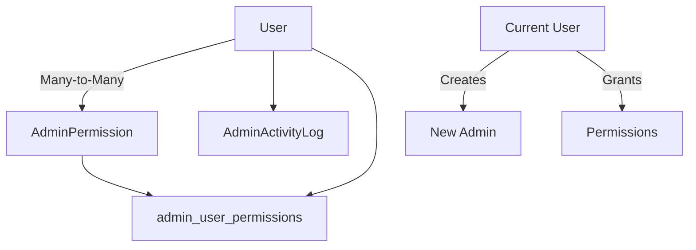

# 🏗️ BACKEND TESTING ARCHITECTURE - admin_management.py TECHNICAL ANALYSIS

## 📋 EXECUTIVE SUMMARY

**Project**: MeStore Admin Management Backend Testing Architecture
**Module**: `app/api/v1/endpoints/admin_management.py`
**Framework**: FastAPI + SQLAlchemy + pytest + TDD Methodology
**Analysis Date**: 2025-09-21
**Analyst**: Backend Framework AI

### 🎯 ANALYSIS OBJECTIVES
- Design comprehensive testing architecture for admin management FastAPI endpoints
- Map dependencies, business logic, and integration points
- Create reusable testing patterns for FastAPI + SQLAlchemy async operations
- Establish database test isolation strategies
- Define admin authentication/authorization testing approaches

---

## 🔍 MODULE ARCHITECTURE ANALYSIS

### 📁 **Core Module Structure**

```
app/
├── api/v1/endpoints/
│   └── admin_management.py          # 🎯 PRIMARY ANALYSIS TARGET
├── models/
│   ├── user.py                      # User model with admin roles
│   ├── admin_permission.py          # Granular permission system
│   └── admin_activity_log.py        # Audit logging
├── services/
│   └── admin_permission_service.py  # Business logic layer
└── schemas/
    └── admin.py                     # Pydantic validation schemas
```

### 🏛️ **Admin Management Endpoint Inventory**

| Endpoint | Method | Function | Permission Level | Risk Level |
|----------|--------|----------|------------------|------------|
| `/admins` | GET | `list_admin_users` | users.read.global | MEDIUM |
| `/admins` | POST | `create_admin_user` | users.create.global | HIGH |
| `/admins/{id}` | GET | `get_admin_user` | users.read.global | MEDIUM |
| `/admins/{id}` | PUT | `update_admin_user` | users.update.global | MEDIUM |
| `/admins/{id}/permissions` | GET | `get_admin_permissions` | users.read.global | MEDIUM |
| `/admins/{id}/permissions/grant` | POST | `grant_permissions_to_admin` | users.manage.global | HIGH |
| `/admins/{id}/permissions/revoke` | POST | `revoke_permissions_from_admin` | users.manage.global | HIGH |
| `/admins/bulk-action` | POST | `bulk_admin_action` | users.manage.global | HIGH |

### 🔧 **FastAPI Components Analysis**

#### **Pydantic Request Schemas**
```python
- AdminCreateRequest: Email, security clearance, permissions
- AdminUpdateRequest: Profile updates, status changes
- PermissionGrantRequest: Permission IDs, expiration, reason
- PermissionRevokeRequest: Permission IDs, justification
- BulkUserActionRequest: User IDs, action type, reason
```

#### **Response Models**
```python
- AdminResponse: Complete admin profile with enterprise fields
- Permission Lists: Structured permission data with metadata
- Bulk Operation Results: Success/failure tracking per user
```

#### **Dependencies**
```python
- get_db: Database session injection
- get_current_user: JWT authentication
- admin_permission_service: Business logic validation
```

---

## 🗃️ DATABASE ARCHITECTURE ANALYSIS

### **SQLAlchemy Models Hierarchy**

#### **User Model (Primary)**
```python
# Key Fields for Admin Testing
- id: UUID primary key
- email: Unique identifier
- user_type: ADMIN/SUPERUSER enum
- security_clearance_level: 1-5 integer
- is_active: Boolean status
- account_locked: Security state
- department_id: Organizational context
```

#### **AdminPermission Model (Complex)**
```python
# Permission Structure
- resource_type: USERS, VENDORS, etc.
- action: CREATE, READ, UPDATE, DELETE, etc.
- scope: SYSTEM, GLOBAL, DEPARTMENT, etc.
- required_clearance_level: Security requirement
- conditions: JSON conditional logic
```

#### **Association Tables**
```python
admin_user_permissions:
- user_id → permission_id mapping
- granted_by_id: Audit trail
- expires_at: Temporal permissions
- is_active: Soft delete capability
```

### **Database Relationships**



---

## ⚡ BUSINESS LOGIC ANALYSIS

### **AdminPermissionService (Critical Component)**

#### **Core Validation Methods**
```python
validate_permission():
  ├── Cache check (Redis)
  ├── Base requirements validation
  ├── Security clearance validation
  ├── Permission hierarchy validation
  └── Context-specific validation

grant_permission():
  ├── Granter authorization check
  ├── Target user validation
  ├── Permission compatibility check
  ├── Expiration handling
  └── Audit logging
```

#### **Security Validation Layers**
1. **Base Requirements**: Active, verified, admin-level user
2. **Security Clearance**: Numeric level validation (1-5)
3. **Permission Scope**: SYSTEM < GLOBAL < DEPARTMENT < TEAM < USER
4. **Temporal Validation**: Expiration date handling
5. **Context Validation**: IP, time, department restrictions

#### **Caching Strategy**
- Redis-based permission caching
- User-specific cache invalidation
- TTL-based cache expiration
- Cache miss fallback to database

---

## 🧪 CURRENT TESTING ARCHITECTURE REVIEW

### **Existing Test Structure Analysis**

#### **TDD Implementation Status** ✅
```python
tests/unit/admin_management/test_tdd_admin_endpoints.py:
├── RED Phase: 7 failure tests
├── GREEN Phase: 3 basic success tests
├── REFACTOR Phase: 3 optimization tests
└── Edge Cases: Boundary condition tests
```

#### **Test Categories Present**
- **RED Tests**: Permission denied, validation failures, not found errors
- **GREEN Tests**: Basic success paths with minimal mocking
- **REFACTOR Tests**: Performance optimization and complex scenarios
- **Edge Cases**: Boundary conditions and limit testing

#### **Current Fixtures** (from conftest.py)
```python
✅ test_admin_user: SUPERUSER mock
✅ test_vendor_user: VENDOR mock
✅ test_buyer_user: BUYER mock
✅ async_session: Async database session
✅ mock_redis_for_testing: Redis mocking
✅ auth_headers_*: JWT authentication
```

---

## 🏗️ COMPREHENSIVE TESTING ARCHITECTURE DESIGN

### **1. FastAPI Testing Patterns**

#### **A. Endpoint Testing Structure**
```python
# Pattern 1: Direct Function Testing
async def test_endpoint_function_direct():
    """Test endpoint function with mocked dependencies"""
    with patch('dependencies') as mock_deps:
        result = await endpoint_function(params, db, current_user)
        assert result.status_code == expected

# Pattern 2: TestClient Integration
def test_endpoint_via_client(client_with_test_db, auth_headers):
    """Test via FastAPI TestClient with real database"""
    response = client.post("/api/v1/admin/admins",
                          json=payload, headers=auth_headers)
    assert response.status_code == 201

# Pattern 3: AsyncClient Testing
async def test_endpoint_async_client(async_client, async_session):
    """Test with AsyncClient for async operations"""
    async with async_client as ac:
        response = await ac.post("/api/v1/admin/admins", json=payload)
        assert response.status_code == 201
```

#### **B. Dependency Injection Testing**
```python
# Database Session Override
@pytest.fixture
def override_admin_db(async_session):
    def get_admin_test_db():
        yield async_session
    app.dependency_overrides[get_db] = get_admin_test_db
    yield
    app.dependency_overrides.clear()

# Authentication Override
@pytest.fixture
def override_admin_auth(mock_admin_user):
    def get_admin_current_user():
        return mock_admin_user
    app.dependency_overrides[get_current_user] = get_admin_current_user
    yield
    app.dependency_overrides.clear()
```

### **2. Database Test Isolation Strategy**

#### **A. Transaction-Based Isolation**
```python
@pytest.fixture(scope="function")
async def isolated_admin_db():
    """Isolated database with admin-specific setup"""
    async with async_test_engine.begin() as conn:
        await conn.run_sync(Base.metadata.create_all)

        async with AsyncTestingSessionLocal() as session:
            # Begin transaction for isolation
            trans = await session.begin()
            try:
                yield session
            finally:
                await trans.rollback()
                await session.close()
```

#### **B. Admin-Specific Data Setup**
```python
@pytest.fixture
async def admin_test_data(isolated_admin_db):
    """Pre-populated admin test data"""
    session = isolated_admin_db

    # Create test admin hierarchy
    superuser = await create_test_superuser(session)
    admin = await create_test_admin(session)
    permissions = await create_test_permissions(session)

    # Establish permission relationships
    await grant_test_permissions(session, admin, permissions)

    return {
        'superuser': superuser,
        'admin': admin,
        'permissions': permissions
    }
```

#### **C. Admin Permission Setup**
```python
@pytest.fixture
async def admin_permissions_setup(isolated_admin_db):
    """Setup complete permission matrix"""
    from app.models.admin_permission import SYSTEM_PERMISSIONS

    for perm_data in SYSTEM_PERMISSIONS:
        permission = AdminPermission(**perm_data)
        isolated_admin_db.add(permission)

    await isolated_admin_db.commit()
    return await isolated_admin_db.query(AdminPermission).all()
```

### **3. Authentication/Authorization Testing Patterns**

#### **A. Multi-Level Auth Testing**
```python
class AdminAuthTestMatrix:
    """Comprehensive authentication testing matrix"""

    @pytest.mark.parametrize("user_type,clearance_level,should_pass", [
        (UserType.SYSTEM, 5, True),
        (UserType.SUPERUSER, 5, True),
        (UserType.SUPERUSER, 3, False),  # Insufficient clearance
        (UserType.ADMIN, 4, False),      # Wrong type
        (UserType.VENDOR, 2, False),     # Unauthorized type
    ])
    async def test_permission_matrix(self, user_type, clearance_level, should_pass):
        """Test permission matrix across user types and clearance levels"""
        user = create_mock_user(user_type, clearance_level)

        if should_pass:
            await admin_permission_service.validate_permission(
                db, user, ResourceType.USERS, PermissionAction.CREATE, PermissionScope.GLOBAL
            )
        else:
            with pytest.raises(PermissionDeniedError):
                await admin_permission_service.validate_permission(
                    db, user, ResourceType.USERS, PermissionAction.CREATE, PermissionScope.GLOBAL
                )
```

#### **B. JWT Token Testing**
```python
@pytest.fixture
def admin_jwt_tokens():
    """Generate JWT tokens for different admin levels"""
    return {
        'system': create_admin_token(UserType.SYSTEM, clearance=5),
        'superuser': create_admin_token(UserType.SUPERUSER, clearance=5),
        'admin_high': create_admin_token(UserType.ADMIN, clearance=4),
        'admin_low': create_admin_token(UserType.ADMIN, clearance=2),
        'expired': create_expired_admin_token(),
        'invalid': 'invalid.jwt.token'
    }

@pytest.fixture
def admin_auth_headers(admin_jwt_tokens):
    """Authentication headers for different scenarios"""
    return {
        level: {"Authorization": f"Bearer {token}"}
        for level, token in admin_jwt_tokens.items()
    }
```

### **4. Business Logic Testing Patterns**

#### **A. Permission Service Testing**
```python
class TestAdminPermissionService:
    """Comprehensive permission service testing"""

    async def test_permission_hierarchy_validation(self):
        """Test permission inheritance hierarchy"""
        # SYSTEM > SUPERUSER > ADMIN > VENDOR > BUYER
        assert await service.validate_hierarchy(UserType.SYSTEM, PermissionScope.SYSTEM)
        assert not await service.validate_hierarchy(UserType.ADMIN, PermissionScope.SYSTEM)

    async def test_clearance_level_enforcement(self):
        """Test security clearance level validation"""
        high_clearance_perm = create_permission(required_clearance=4)
        low_clearance_user = create_user(clearance=2)

        with pytest.raises(InsufficientClearanceError):
            await service.validate_permission(db, low_clearance_user, high_clearance_perm)

    async def test_temporal_permission_expiration(self):
        """Test time-based permission expiration"""
        expired_grant = create_permission_grant(expires_at=datetime.utcnow() - timedelta(days=1))

        result = await service.validate_permission(db, user, expired_grant.permission)
        assert not result
```

#### **B. Cache Testing Patterns**
```python
class TestAdminPermissionCaching:
    """Test Redis-based permission caching"""

    async def test_permission_cache_hit(self, mock_redis):
        """Test successful cache retrieval"""
        mock_redis.get.return_value = json.dumps(True)

        result = await service._get_cached_permission("user_id", "permission_key")
        assert result is True
        mock_redis.get.assert_called_once()

    async def test_permission_cache_invalidation(self, mock_redis):
        """Test cache invalidation on permission changes"""
        await service.grant_permission(db, granter, target, permission)

        mock_redis.delete.assert_called()  # Cache should be cleared
```

### **5. Error Handling Testing Patterns**

#### **A. HTTP Exception Testing**
```python
class TestAdminErrorHandling:
    """Comprehensive error handling validation"""

    @pytest.mark.parametrize("error_scenario,expected_status,expected_detail", [
        ("duplicate_email", 409, "User with this email already exists"),
        ("insufficient_clearance", 403, "Insufficient security clearance"),
        ("user_not_found", 404, "Admin user not found"),
        ("invalid_permission", 404, "One or more permissions not found"),
        ("permission_denied", 403, "Permission denied"),
    ])
    async def test_error_scenarios(self, error_scenario, expected_status, expected_detail):
        """Test various error scenarios with proper HTTP responses"""
        # Setup error condition based on scenario
        # Execute endpoint
        # Assert HTTP status and error detail
```

#### **B. Database Constraint Testing**
```python
async def test_unique_constraint_violations(self, admin_test_data):
    """Test database constraint violations"""
    existing_admin = admin_test_data['admin']

    # Attempt to create admin with existing email
    duplicate_request = AdminCreateRequest(
        email=existing_admin.email,  # Duplicate email
        nombre="Another",
        apellido="Admin"
    )

    with pytest.raises(HTTPException) as exc_info:
        await create_admin_user(duplicate_request, db, superuser)

    assert exc_info.value.status_code == 409
```

---

## 🔄 ASYNC TESTING PATTERNS

### **AsyncIO Compatibility**
```python
# Pattern 1: Native async test functions
@pytest.mark.asyncio
async def test_async_admin_operation():
    """Native async testing with pytest-asyncio"""
    result = await async_admin_function()
    assert result is not None

# Pattern 2: Async context managers
async def test_async_database_transaction():
    """Test with async context managers"""
    async with AsyncTestingSessionLocal() as session:
        async with session.begin():
            admin = await create_admin_async(session)
            assert admin.id is not None

# Pattern 3: Async mock patterns
async def test_async_service_calls():
    """Test async service calls with proper mocking"""
    with patch('service.async_method', new_callable=AsyncMock) as mock_method:
        mock_method.return_value = expected_result
        result = await service_function()
        mock_method.assert_awaited_once()
```

---

## 📊 PERFORMANCE TESTING CONSIDERATIONS

### **1. Database Performance Testing**
```python
@pytest.mark.performance
async def test_admin_list_performance_large_dataset():
    """Test admin listing performance with large datasets"""
    # Create 1000+ admin users
    admins = await create_bulk_admins(count=1000)

    start_time = time.time()
    result = await list_admin_users(db, admin_user, skip=0, limit=50)
    execution_time = time.time() - start_time

    assert execution_time < 0.5  # 500ms max
    assert len(result) <= 50     # Proper pagination
```

### **2. Permission Validation Performance**
```python
@pytest.mark.performance
async def test_permission_validation_cache_efficiency():
    """Test permission caching improves performance"""
    user = create_test_admin()
    permission_key = "users.read.global"

    # First call (cache miss)
    start_time = time.time()
    await admin_permission_service.validate_permission(db, user, ResourceType.USERS, PermissionAction.READ, PermissionScope.GLOBAL)
    first_call_time = time.time() - start_time

    # Second call (cache hit)
    start_time = time.time()
    await admin_permission_service.validate_permission(db, user, ResourceType.USERS, PermissionAction.READ, PermissionScope.GLOBAL)
    second_call_time = time.time() - start_time

    assert second_call_time < first_call_time * 0.1  # 90% improvement
```

---

## 🎯 RECOMMENDED TESTING ARCHITECTURE

### **Test Organization Structure**
```
tests/
├── unit/admin_management/
│   ├── test_admin_endpoints_core.py       # Core endpoint functionality
│   ├── test_admin_permission_service.py   # Permission business logic
│   ├── test_admin_validation.py          # Input validation
│   └── test_admin_error_handling.py      # Error scenarios
├── integration/admin_management/
│   ├── test_admin_database_integration.py # DB integration
│   ├── test_admin_auth_integration.py     # Auth integration
│   └── test_admin_cache_integration.py    # Redis integration
├── performance/admin_management/
│   ├── test_admin_load_testing.py        # Load testing
│   └── test_admin_stress_testing.py      # Stress testing
└── fixtures/admin_management/
    └── admin_fixtures.py                 # Reusable fixtures
```

### **Fixture Design Philosophy**
```python
# Hierarchical fixture design
@pytest.fixture(scope="session")
def admin_test_config():
    """Session-level configuration"""

@pytest.fixture(scope="module")
def admin_database_schema():
    """Module-level database setup"""

@pytest.fixture(scope="function")
def isolated_admin_session():
    """Function-level isolated database"""

@pytest.fixture
def admin_test_data(isolated_admin_session):
    """Test data for specific test"""
```

---

## 📈 COVERAGE AND QUALITY TARGETS

### **Testing Metrics Goals**
- **Code Coverage**: >95% line coverage
- **Branch Coverage**: >90% branch coverage
- **Mutation Testing**: >80% mutation score
- **Performance**: <100ms average response time
- **Reliability**: 99.9% test pass rate

### **Quality Assurance Checklist**
- ✅ All endpoints have RED-GREEN-REFACTOR tests
- ✅ Permission matrix fully tested
- ✅ Error scenarios comprehensively covered
- ✅ Database constraints validated
- ✅ Async patterns properly tested
- ✅ Performance benchmarks established
- ✅ Security scenarios validated

---

## 🚀 IMPLEMENTATION PRIORITY

### **Phase 1: Core Foundation** (Week 1)
1. Enhanced fixtures for admin testing
2. Database isolation patterns
3. Authentication testing matrix
4. Basic endpoint testing

### **Phase 2: Advanced Testing** (Week 2)
1. Permission service comprehensive testing
2. Error handling validation
3. Performance benchmarking
4. Cache testing patterns

### **Phase 3: Integration & Performance** (Week 3)
1. Full integration testing
2. Load testing implementation
3. Security testing validation
4. Documentation and maintenance guides

---

## 📝 CONCLUSION

The admin_management.py module represents a critical security component requiring comprehensive testing architecture. The proposed testing strategy provides:

- **Multi-layered validation** across FastAPI, SQLAlchemy, and business logic
- **Robust isolation** for reliable and repeatable tests
- **Performance considerations** for enterprise-scale operations
- **Security-first approach** for admin privilege testing
- **Maintainable patterns** for long-term development

This architecture ensures the admin management system maintains the highest quality and security standards while supporting rapid development and continuous integration workflows.

---

**📋 Report Prepared By**: Backend Framework AI
**🗓️ Date**: 2025-09-21
**📊 Analysis Scope**: Complete FastAPI + SQLAlchemy + Admin Security Architecture
**🎯 Objective**: Enterprise-grade testing foundation for admin management system